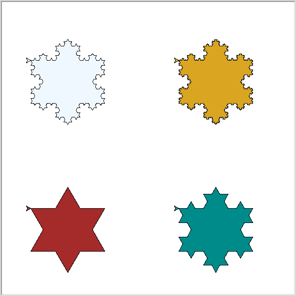

# Koch Curve Fractal Grid

This Python project utilizes the Turtle module to draw a grid of Koch curve fractals. Each cell in the grid contains a Koch curve with a different order, providing a visually appealing demonstration of fractal geometry.

## Features
- Draws a grid of Koch curve fractals.
- Each fractal has a different order, showcasing varying levels of complexity.
- Background colors distinguish each fractal within the grid.
- The grid lines are not visible, ensuring focus on the fractals themselves.

## Requirements
- Python 3
- Turtle module (included in standard Python installation)

## Usage
1. Clone the repository or copy the Python code into a Python file.
2. Run the Python script.
3. The Turtle graphics window will open, displaying the grid of Koch curve fractals.

Alternatively, you can check out the running code in this Replit [here](https://replit.com/@bernhard759/KochCurve)

## Customization
- Adjust the `size` parameter in the `draw_koch_curve` function to change the size of the fractals.
- Modify the `colors` list in the `draw_grid` function to change the background colors of the fractals.

## Example

## Credits
This project was created by me with the help of a friendly chatbot ;)

Feel free to explore, experiment, and modify the code to create your own variations of the Koch curve fractal grid!
